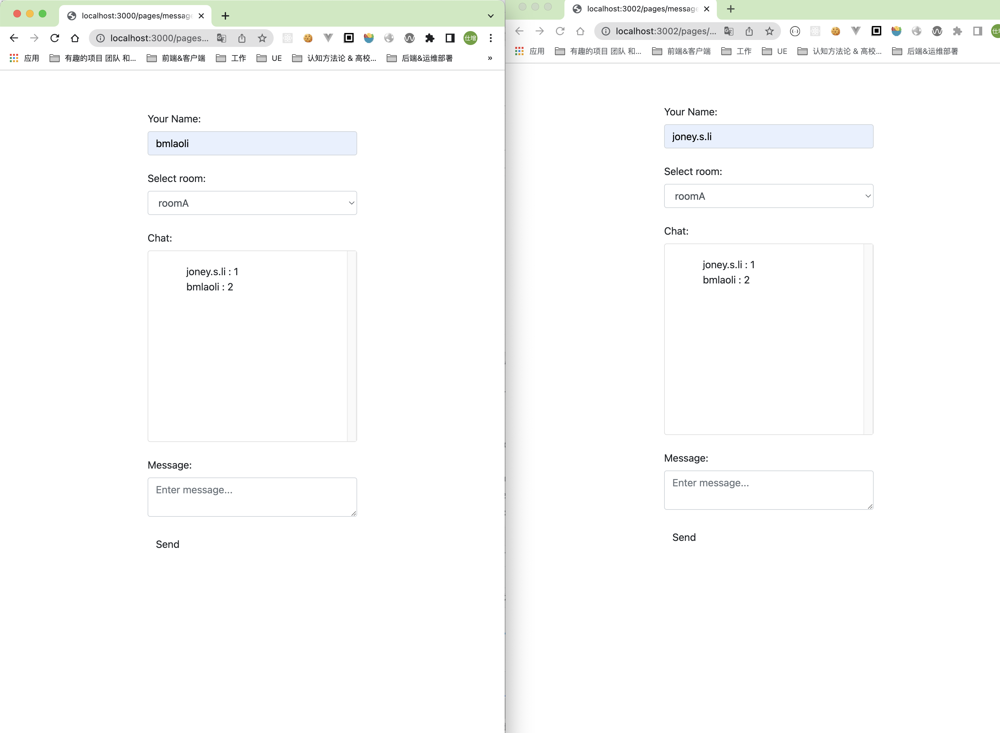

# 如何在Nest中集成 websocket
>
> 这是一个有趣的话题，接下来我们来探讨 🧐 研究一下
>

需要先安装好 依赖 注意版本 默认适配NestCore 9.0.0 若报错请把它 缓存你的NestCore Version

```shell
yarn add @nestjs/websockets @nestjs/platform-socket.io
```

## Getwary

声明 modules

```ts
import { Module } from '@nestjs/common';
import { EventsGateway } from './events.gateway';

@Module({
  providers: [EventsGateway],
})
export class EventModule {}

```

先搞定Service 端

```ts
import { UseFilters } from '@nestjs/common';
import {
  MessageBody,
  SubscribeMessage,
  WebSocketGateway,
  WebSocketServer,
  ConnectedSocket,
  WsException,
} from '@nestjs/websockets';
import { log } from 'console';
import { Socket } from 'dgram';
import { from, Observable } from 'rxjs';
import { map } from 'rxjs/operators';
import { Server } from 'socket.io';
import { AllExceptionsFilterWithWs } from './filter/allExceptions.filter';

// 默认可以WebSocketGateway(80,options) 这个port 可指定若不指定就是 同样的port 监听
@WebSocketGateway({
  cors: {
    origin: '*',
  },
})
export class EventsGateway {
  // 直接访问原生的、特定于平台的服务器实例
  @WebSocketServer()
  server: Server;

  // 如果有人发消息 就会触发 这个 handler
  @SubscribeMessage('events')
  handleEvent(
    @MessageBody() data: any,
    @ConnectedSocket() client: Socket,
  ): any {
    // client.emit('events', { ...data, message: 'Servier return you ' });
    // return data  请不要用return 请看这个 issues https://github.com/nestjs/nest/issues/11439

    // 如果你是 异步 的也可以支持 狐疑 from 是连发Array Item 哈，详见RXJS 更多的也请 参考RXJS
    from([1, 2, 3, 4])
      .pipe(map((data) => data))
      .subscribe((res) => {
        client.emit('events', { data: res, message: 'Servier return you ' });
      });
  }

  @SubscribeMessage('identity')
  async identity(@MessageBody() data: number): Promise<number> {
    return data;
  }

  // 以下是三个 WebSocketGateway生命周期hook
  afterInit() {
    log('OnGatewayInit');
  }

  handleConnection() {
    log('OnGatewayConnection');
  }

  handleDisconnect() {
    log('OnGatewayDisconnect');
  }
}

```

再把 html搞定 参考 文档 <a href="https://socket.io/zh-CN/" > Socket.IO </a>

```html
<html>
  <head>
    <script src="https://cdn.socket.io/4.3.2/socket.io.min.js" integrity="sha384-KAZ4DtjNhLChOB/hxXuKqhMLYvx3b5MlT55xPEiNmREKRzeEm+RVPlTnAn0ajQNs" crossorigin="anonymous"></script>
    <script>
      const socket = io('http://127.0.0.1:3000');
      socket.on('connect', function() {
        console.log('Connected');
        socket.emit('events', { test: 'test' });
        socket.emit('identity', 0, response =>
          console.log('Identity:', response),
        );

        socket.emit('errorTest',0)
        // socket.emit('pipData',0)
        socket.emit('pipData',{
          email:'bmlishizeng@gmail.com',
          password:"666"
        })
      });

      socket.on('events', function(data) {
        console.log('event', data);
      });    
      socket.on('pipData', function(data) {
        console.log('pipData', data);
      });    
      socket.on('exception', function(data) {
        console.log('exception', data);
      });
      socket.on('disconnect', function() {
        console.log('Disconnected');
      });
    </script>
  </head>

  <body></body>
</html>
```

## Error

>
> 有点特殊

```ts

// 若你抛error 请使用 这样在 client 收的时候 就能收到，若想优雅请使用 fillter (需要自定义)
// @SubscribeMessage('errorTest')
// errDemo(@MessageBody() data: any, @ConnectedSocket() clinet: Socket) {
//   throw new WsException('Invalid credentials.');
// }
@UseFilters(new AllExceptionsFilterWithWs())
@SubscribeMessage('errorTest')
errDemo(@MessageBody() data: any, @ConnectedSocket() clinet: Socket) {
  throw new Error('Invalid credentials.');
}

import { Catch, ArgumentsHost } from '@nestjs/common';
import { BaseWsExceptionFilter } from '@nestjs/websockets';

@Catch()
export class AllExceptionsFilterWithWs extends BaseWsExceptionFilter {
  catch(exception: unknown, host: ArgumentsHost) {
    // + 各种花里胡哨的逻辑
    super.catch(exception, host);
  }
}

```

## Pip
>
> 和普通的pip 没区别 注意 不要抛 HttpException, 而且我们仅 pip data

```ts
@UsePipes(new ValidationPipe())
@SubscribeMessage('events')
handleEvent(client: Client, data: TestDto): WsResponse<unknown> {
  const event = 'events';
  return { event, data };
}

```

## Guard
>
> Guards 和普通的一样(不演示了) 建议为 ws 自定义一个 Guards 让它 抛出 非HttpException
>
## Interceptors
>
> Interceptor 和普通的一样(不演示了) 建议为 ws 自定义一个 Interceptor 让它 抛出 非HttpException

## Adapter
>
> Nest 的ws 和 使用何种 第三方库 无关， 与平台无关， 我们可以使用 WebSocketAdapter/Nodejs原生实现 ，来看几个例子 WebSocketAdapter 从 @nestjs/common 来

请强制实现 WebSocketAdapter 要求的方法

|method|des|
|-------|---------|
| create | 将套接字实例连接到指定的端口 |
| bindClientConnect | 绑定客户端连接事件 |
| bindClientDisconnect | 绑定客户端断开连接事件（可选） |
| bindMessageHandlers | 将传入的消息绑定到适当的消息处理程序 |
| close | 终止服务器实例 |

### 例子 扩展socket.io 功能
>
> 我们有一个需求 要求 ws 能够跨多个 node 实例 （分布式） ，我们找来 一个plugin ，注意看 v9 的官方英文文档，中文文档又许多纰漏的地方

注意V9 官方文档说明：“transports: ['websocket']” 是必须的，而且对客户端也有要求 <https://socket.io/docs/v4/using-multiple-nodes/#enabling-sticky-session>

```shell
yarn add  redis socket.io @socket.io/redis-adapter
```

简单初始化

```ts
～ RedisIoAdapter.ts
import { IoAdapter } from '@nestjs/platform-socket.io';
import { ServerOptions } from 'socket.io';
import { createAdapter } from '@socket.io/redis-adapter';
import { createClient } from 'redis';

export class RedisIoAdapter extends IoAdapter {
  private adapterConstructor: ReturnType<typeof createAdapter>;

  async connectToRedis(): Promise<void> {
    const pubClient = createClient({ url: `redis://localhost:6379` });
    const subClient = pubClient.duplicate();

    await Promise.all([pubClient.connect(), subClient.connect()]);

    this.adapterConstructor = createAdapter(pubClient, subClient);
  }

  createIOServer(port: number, options?: ServerOptions): any {
    const server = super.createIOServer(port, options);
    server.adapter(this.adapterConstructor);
    return server;
  }
}

~ main.ts
const app = await NestFactory.create(AppModule);
const redisIoAdapter = new RedisIoAdapter(app);
await redisIoAdapter.connectToRedis();

app.useWebSocketAdapter(redisIoAdapter);

```

使用> 我们来实现需求 "我希望做一个这样的客户端" 见下图


而且要求 它们可以多机器部署 是一个分布式的

我们先把 service 搞好

```ts
@WebSocketGateway({
  transports: ['websocket'],
  cors: {
    origin: '*',
    methods: ['GET', 'POST'],
    credentials: true,
  },
})
export class EventsGateway {
  // 直接访问原生的、特定于平台的服务器实例
  @WebSocketServer()
  server: Server;
  ++++ 这里是一些其它demo 例子 会干扰 这里几不放出来了
  // 向Room 推消息
  @SubscribeMessage('msgToServer')
  public handleMessage(client: Socket, payload: any) {
    return this.server.to(payload.room).emit('msgToClient', payload);
  }

  // 某人加入某Room
  @SubscribeMessage('joinRoom')
  public joinRoom(client: Socket, room: any): void {
    client.join(room.room);
    client.emit('joinedRoom', room);
  }

  // 某人离开某Room
  @SubscribeMessage('leaveRoom')
  public leaveRoom(client: Socket, room: any): void {
    client.leave(room.room);
    client.emit('leftRoom', room);
  }
}
```

然后我们来看看 客户端
(注意 客户端我依然沿用之前的写的hbs) 一些js 和 css 请看git 仓库

```html
～ message.hbs
<html>
  <head>
    <!-- CSS -->
    <link rel="stylesheet" href="https://maxcdn.bootstrapcdn.com/bootstrap/4.0.0-alpha.6/css/bootstrap.min.css" integrity="sha384-rwoIResjU2yc3z8GV/NPeZWAv56rSmLldC3R/AZzGRnGxQQKnKkoFVhFQhNUwEyJ" crossorigin="anonymous">
    <link href="https://cdn.bootcdn.net/ajax/libs/twitter-bootstrap/4.6.2/css/bootstrap.min.css" rel="stylesheet" integrity="sha384-xOolHFLEh07PJGoPkLv1IbcEPTNtaed2xpHsD9ESMhqIYd0nLMwNLD69Npy4HI+N" crossorigin="anonymous">

    <link rel="stylesheet" href="/static/css/message.css">
    <script src="https://cdn.socket.io/4.3.2/socket.io.min.js" integrity="sha384-KAZ4DtjNhLChOB/hxXuKqhMLYvx3b5MlT55xPEiNmREKRzeEm+RVPlTnAn0ajQNs" crossorigin="anonymous"></script>
    <style>
      li {
        list-style: none;
      }
    </style>
  </head>

  <body>
    <div id="app" class="container">
    <div class="row">
        <div class="col-md-6 offset-md-3 col-sm-12">
            <h1 class="text-center">{{ title }}</h1>
            <br>
            <div id="status"></div>
            <div id="chat">
                <label for="username">Your Name:</label>
                <input type="text"  id="username" class="form-control" placeholder="Enter name...">
                <br>
                <label for="room">Select room:</label>
                <select class="form-control"  id="room" >
                    <option value="general">general</option>
                    <option value="roomA">roomA</option>
                    <option value="roomB">roomB</option>
                    <option value="roomC">roomC</option>
                    <option value="roomD">roomD</option>
                </select>
                <br>
                <label for="messages">Chat:</label>
                <div class="card">
                    <div id="messages" class="card-block">
                        <ul id="messages-ul">
                         
                        </ul>
                    </div>
                </div>
                <br>
                <label for="textarea">Message:</label>
                <textarea id="textarea" class="form-control" v-model="text" placeholder="Enter message..."></textarea>
                <br>
                <button id="send" class="btn">Send</button>
            </div>
        </div>
    </div>
</div>

  </body>
   <script>
      const test2 = () => {
        const select =  document.querySelector('#room')
        const textInput =  document.querySelector('#username')
        const sendBtn =  document.querySelector('#Send')
        const textarea =  document.querySelector('#textarea');

        const ROOM = {
          messageList:[],
          info: { 
          },
          currentRoom:'general'
        };

        const renderMessageList = (message) => {
            // 先存
            if(message){
              ROOM.messageList.push(message)
            }
            
            // 然后渲染
              const messageUl =  document.querySelector('#messages-ul')
              const _html = (name,msg) => `
                <li> 
                  <span> ${name} : </span>
                  <span> ${msg}</span>
                </li>
              `
              let _listHtml = '';

              ROOM.messageList.filter(it => it.room === select.value).forEach(item => {
                _listHtml += _html(item.name, item.text)
              });
              
              messageUl.innerHTML = _listHtml;
          };

        const main = (socket) => {
        
          const selectRoomHandle = (tart) => {
            
            if( ROOM.currentRoom ==  tart.target.value ) return;
              socket.emit('leaveRoom', {
                  name: textInput.value,
                  room: ROOM.currentRoom
              });
              socket.emit('joinRoom', {
                  name: textInput.value,
                  room: tart.target.value
                });
            ROOM.currentRoom=tart.target.value;
          };

          const sendHandle = () => {
              const message = {
                name: textInput.value,
                text: textarea.value,
                room: select.value,
              };
              socket.emit('msgToServer', message);
              textarea.value= '';
          };
        
          select.addEventListener('change', selectRoomHandle);
          sendBtn.addEventListener('click', sendHandle);
        }

      // 注意 本地开发是 同一个机器同一个端口，我们一会儿用docker 去构建两个 分别测试 所以这里一会儿要改
        const socket = io('ws://127.0.0.1:3000', {
              transports: [ "websocket" ],
                withCredentials: true
            });

        socket.on('msgToClient', (message) => {
            console.log('msgToClient', message);
            renderMessageList(message)
        });

        socket.on('connect', () => {
            console.log('connect->',)
            main(socket)
        });
      
        socket.on('disconnect', function() {
          console.log('joinedRoom->',room)
        });

        socket.on('joinedRoom', (room) => {
          console.log('joinedRoom->',room)
        });

        socket.on('leftRoom', (room) => {
              console.log('leftRoom->',room)
        });

      }
test2()
    </script>
</html>
```

好以上就是基础的内容了，现在我们用docker 去验证一下 看看分布式的 部署能够被应用

Docker 题外话

首先docker 基础知识这里不讲了 请看我的文章link

```dockerfile
FROM node:lts-alpine
ENV NODE_ENV=production
WORKDIR /app
COPY ["package.json", "yarn.lock", "./"]
RUN yarn --production --silent
RUN rm package.json yarn.lock
COPY ./ .
EXPOSE 3002
# CMD ["node --enable-source-maps ", "main.js"]
```

```docker
**/*.js.map
**/*.d.ts
/node_modules
**/tsconfig.build.tsbuildinfo
```

```shell
# build 两个 img 记得 第二次build 改一下 3000 和 hbs 中的3000 port
$ yarn build
$ docker build -t nest_app1 .

$ yarn build
$ docker build -t nest_app2 .
```

然后我们涉及到两个 container 的互相访问，我们需要建立bridge 网络，参考 <https://zhuanlan.zhihu.com/p/258939355>

当然你也可以使用 docker-compaser把需要的东西 放到一起 ，这也是可以的，我这里就不详细的说了

```shell
docker network create testnet
docker network inspect testnet
docker run -itd --name nest_app1  -p 3000:3000 --network testnet  nest_app1
docker run -itd --name nest_app2  -p 3002:3002 --network testnet  nest_app2
```

然后去 流浪器进行 测试，发现是没有问题的！完成✅ 至此 多实例的socket.io 完成


### 例子 用集成ws WsAdapter
>
> 它反过来又充当框架之间的代理，集成极快且经过全面测试的 ws 库。传说中这个性能比 socket.io  好，但....功能要少

注意 这个玩意儿 不支持 namespaces ，但是你可以使用 { path: '/users' } 来模拟 效果一样

```shell
yarn add @nestjs/platform-ws
```

Service 端

```ts
～ main.ts
  app.useWebSocketAdapter(new WsAdapter(app));


～ events.gateway.ts


@WebSocketGateway({
  transports: ['websocket'],
  cors: {
    origin: '*',
    methods: ['GET', 'POST'],
    credentials: true,
  },
})
++++
// 如果有人发消息 就会触发 这个 handler
@SubscribeMessage('events')
handleEvent(
  @MessageBody() data: any,
  @ConnectedSocket() client: Socket,
): any {
  const sendData = { ...data, message: 'Servier return you ' };
  // 2 -------- 如果你import { WsAdapter } from '@nestjs/platform-ws';
  //  return 是有效的，且不是emit 而是send string!
  // 另外 返回的数据只有一段string 如果需要实现 nameSpace 需要自己去整 socket.io 则要简单些
  client.send(JSON.stringify(sendData));
  // return JSON.stringify(sendData)
}

```

Client 端 还是在之前的message.hbs 加东西 这次我们加一个原生的WS

```js
   const test3 = () => {
      const ws = new WebSocket('ws://127.0.0.1:3000');
      // Connection opened
      ws.addEventListener('open', function (event) {
          ws.send(JSON.stringify({
            event:"events", // 注意加 event 要不然 service 的 subscriber 不生效
            data:{
              text:6
            }
          }));
      });

      // Listen for messages
      ws.addEventListener('message', function (event) {
          console.log(event)
      });
    }
```

### 例子 完全自实现一个 随意自定义的
>
> 一般来说 看你业务的发展程度，95% 的用户 也许不会用到这个操作

Service

```ts

/* eslint-disable @typescript-eslint/ban-types */
import * as WebSocket from 'ws';
import { WebSocketAdapter, INestApplicationContext } from '@nestjs/common';
import { MessageMappingProperties } from '@nestjs/websockets';
import { Observable, fromEvent, EMPTY } from 'rxjs';
import { mergeMap, filter } from 'rxjs/operators';

export class MyWsAdapter implements WebSocketAdapter {
  constructor(private app: INestApplicationContext) {}

  create(port: number, options: any = {}): any {
    const value = new WebSocket.Server({ port, ...options });
    return value;
  }

  bindClientConnect(server, callback: Function) {
    server.on('connection', callback);
  }

  bindMessageHandlers(
    client: WebSocket,
    handlers: MessageMappingProperties[],
    process: (data: any) => Observable<any>,
  ) {
    fromEvent(client, 'message')
      .pipe(
        mergeMap((data) => this.bindMessageHandler(data, handlers, process)),
        filter((result) => result),
      )
      .subscribe((response) => client.send(JSON.stringify(response)));
  }

  bindMessageHandler(
    buffer,
    handlers: MessageMappingProperties[],
    process: (data: any) => Observable<any>,
  ): Observable<any> {
    const message = JSON.parse(buffer.data);
    const messageHandler = handlers.find(
      (handler) => handler.message === message.event,
    );
    if (!messageHandler) {
      return EMPTY;
    }
    return process(messageHandler.callback(message.data));
  }

  close(server) {
    server.close();
  }
}


app.useWebSocketAdapter(new MyWsAdapter(app)); 
```

注意要主动的声明端口

```ts
@WebSocketGateway(3001)
export class EventsGateway {
  // 直接访问原生的、特定于平台的服务器实例
  @WebSocketServer()
  server: Server;

  @SubscribeMessage('myAdapter')
  myAdapter(@MessageBody() data: any, @ConnectedSocket() client: Socket) {
    log('data', data);
    client.send('myAdapter', '7777777');
  }
}
```

Client 端 继续要使用原生的WS

```js

const test4 = () => {
        const socket = new WebSocket('ws://localhost:3001');
        socket.onopen = function() {
          console.log('Connected');
          socket.send(
            JSON.stringify({
              event: 'myAdapter',
              data: 'test',
            }),
          );
          socket.onmessage = function(data) {
            console.log(data);
          };
        };
    }
```

这样 这个完全自定义的 ws 就好了，但是我不建议，除非你是这方面的高高手，如果仅仅为了使用 ws ，那么为什么不去扩展 @nestjs/platform-ws 的 WsAdapter 呢
